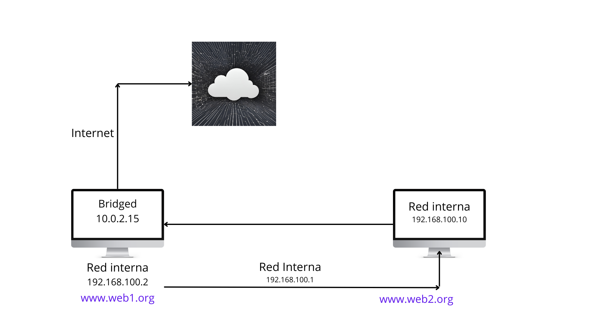

# Esquema de Red.

Como se observa en la imagen, tenemos dos host. El primer host tiene dos tarjeta de red, con una hacemos una red externa (tiene asceso a internet) y la otra tarjeta es una red interna.
Con la red externa podremos descargarnos los archivos necesarios para la instalación de **Nginx**. La red interna está conectada al segundo host.

- La ip de la red externa es la 10.0.2.15.

- La ip de la red interna es 192.168.100.10.

El segundo host solo tiene una tarjeta de red y es una red interna (no tiene acceso a internet). El host estará conectado a la misma red que el host 1. Por lo que se verán en la misma red.
Se pueden hacer ping entre ellos. Si le haceramos ping a la red externa nos saldria fallido.

